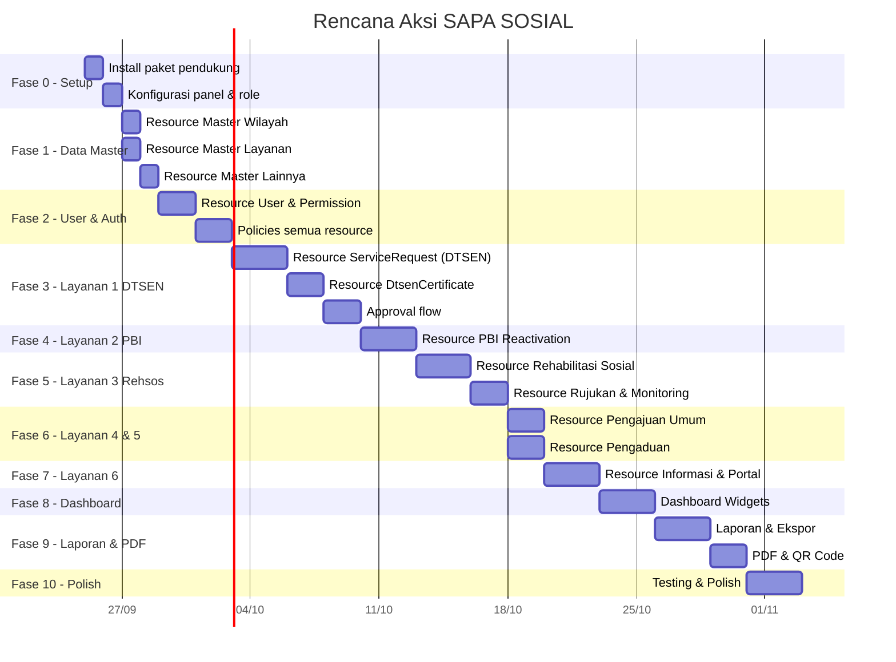

# 🗺️ Rencana Aksi — SAPA SOSIAL Dashboard (Filament v5)

> **Project:** SAPA SOSIAL — Satu Pintu Layanan Sosial Kabupaten Blitar
> **Stack:** Laravel 13 · Filament v5.8 · Livewire v4 · Tailwind CSS v4 · PostgreSQL
> **Tanggal:** 25 September 2026

---

## 📋 Status Proyek Saat Ini

| Komponen | Status |
|----------|--------|
| Database migrations (34 file, semua tabel PRD) | ✅ Selesai |
| Eloquent Models (31 model) | ✅ Selesai |
| PHP Enums (12 enum) | ✅ Selesai |
| Seeders (14 seeder, termasuk data wilayah & dummy) | ✅ Selesai |
| Admin Panel Provider (konfigurasi dasar) | ✅ Selesai |
| Filament Resources | ❌ Belum ada |
| Policies & Authorization | ❌ Belum ada |
| Dashboard Widgets | ❌ Belum ada |
| Portal Publik (Livewire) | ❌ Belum ada |
| Laporan & Ekspor | ❌ Belum ada |
| PDF Generation & QR | ❌ Belum ada |
| spatie/laravel-permission | ❌ Belum di-install |
| spatie/laravel-activitylog | ❌ Belum di-install |

---

## 🏗️ Arsitektur Fase Pengembangan

---

## Fase 0 — Setup & Konfigurasi Dasar

> **Tujuan:** Menyiapkan semua paket pendukung dan konfigurasi fondasi.

### 0.1 Install Paket Pendukung

| # | Task | Command / Detail |
|---|------|-----------------|
| 0.1.1 | Install spatie/laravel-permission | `composer require spatie/laravel-permission` |
| 0.1.2 | Publish & migrate permission tables | `php artisan vendor:publish --provider="Spatie\Permission\PermissionServiceProvider"` lalu `php artisan migrate` |
| 0.1.3 | Install spatie/laravel-activitylog | `composer require spatie/laravel-activitylog` |
| 0.1.4 | Publish activitylog config | `php artisan vendor:publish --provider="Spatie\Activitylog\ActivitylogServiceProvider"` |
| 0.1.5 | Install barryvdh/laravel-dompdf | `composer require barryvdh/laravel-dompdf` |
| 0.1.6 | Install simplesoftwareio/simple-qrcode | `composer require simplesoftwareio/simple-qrcode` |
| 0.1.7 | Install filament/spatie-laravel-permission-plugin (jika ada untuk v5) | Cek kompatibilitas, alternatif buat manual |
| 0.1.8 | Install maatwebsite/excel atau pakai Filament Export Action | Sesuaikan dengan kompatibilitas Filament v5 |

> [!IMPORTANT]
> Setiap paket **wajib** dicek kompatibilitasnya dengan Filament v5 / Livewire v4 sebelum install. Jalankan `composer show <package>` untuk verifikasi.

### 0.2 Konfigurasi Dasar

| # | Task | Detail |
|---|------|--------|
| 0.2.1 | Tambah trait `HasRoles` ke model [User.php](file:///c:/laragon/www/app-layanan/app/Models/User.php) | `use Spatie\Permission\Traits\HasRoles;` |
| 0.2.2 | Tambah trait `LogsActivity` ke model transaksi | ServiceRequest, Complaint, RehabilitationCase, Referral, DtsenCertificate, PbiReactivation |
| 0.2.3 | Buat seeder untuk roles & permissions | Roles: `administrator`, `petugas_dinsos`, `pejabat_penandatangan`, `pimpinan`, `operator_kecamatan_desa`, `masyarakat` |
| 0.2.4 | Update [UserSeeder.php](file:///c:/laragon/www/app-layanan/database/seeders/UserSeeder.php) | Assign roles ke user yang sudah ada |
| 0.2.5 | Konfigurasi timezone di `config/app.php` | `'timezone' => 'Asia/Jakarta'` |
| 0.2.6 | Konfigurasi filesystem disk privat | Tambah disk `private` di `config/filesystems.php` untuk dokumen sensitif |
| 0.2.7 | Konfigurasi queue driver `database` | Di `.env`: `QUEUE_CONNECTION=database` |

### 0.3 Konfigurasi Panel Admin Filament

| # | Task | Detail |
|---|------|--------|
| 0.3.1 | Update [AdminPanelProvider.php](file:///c:/laragon/www/app-layanan/app/Providers/Filament/AdminPanelProvider.php) | Tambah: branding (nama "SAPA SOSIAL"), navigation groups, global search, SPA mode |
| 0.3.2 | Konfigurasi navigation groups | `'Data Master'`, `'Pelayanan'`, `'Rehabilitasi Sosial'`, `'Pengaduan'`, `'Informasi'`, `'Laporan'`, `'Pengaturan'` |
| 0.3.3 | Konfigurasi warna & tema | Sesuaikan warna primer, dark mode support |
| 0.3.4 | Aktifkan global search | `->globalSearchKeyBindings(['command+k', 'ctrl+k'])` |

---

## Fase 1 — Filament Resources: Data Master

> **Tujuan:** Membangun CRUD untuk semua tabel master/referensi.

### 1.1 Master Wilayah

| # | Resource | Model | Fitur |
|---|----------|-------|-------|
| 1.1.1 | `DistrictResource` | [District](file:///c:/laragon/www/app-layanan/app/Models/District.php) | CRUD, search, filter aktif, relasi ke villages |
| 1.1.2 | `VillageResource` | [Village](file:///c:/laragon/www/app-layanan/app/Models/Village.php) | CRUD, filter by district, search |

### 1.2 Master Organisasi

| # | Resource | Model | Fitur |
|---|----------|-------|-------|
| 1.2.1 | `WorkUnitResource` | [WorkUnit](file:///c:/laragon/www/app-layanan/app/Models/WorkUnit.php) | CRUD, toggle is_active |

### 1.3 Master Layanan

| # | Resource | Model | Fitur |
|---|----------|-------|-------|
| 1.3.1 | `ServiceTypeResource` | [ServiceType](file:///c:/laragon/www/app-layanan/app/Models/ServiceType.php) | CRUD, dengan relation manager ke `ServiceRequirement` |
| 1.3.2 | `ServiceRequirementResource` | [ServiceRequirement](file:///c:/laragon/www/app-layanan/app/Models/ServiceRequirement.php) | Sebagai Relation Manager di ServiceType, reorderable |
| 1.3.3 | `DtsenPurposeResource` | [DtsenPurpose](file:///c:/laragon/www/app-layanan/app/Models/DtsenPurpose.php) | CRUD, max_decile, validity_days |

### 1.4 Master Rehabilitasi & Pengaduan

| # | Resource | Model | Fitur |
|---|----------|-------|-------|
| 1.4.1 | `ClientCategoryResource` | [ClientCategory](file:///c:/laragon/www/app-layanan/app/Models/ClientCategory.php) | CRUD sederhana |
| 1.4.2 | `ReferralInstitutionResource` | [ReferralInstitution](file:///c:/laragon/www/app-layanan/app/Models/ReferralInstitution.php) | CRUD, toggle is_active |
| 1.4.3 | `ComplaintCategoryResource` | [ComplaintCategory](file:///c:/laragon/www/app-layanan/app/Models/ComplaintCategory.php) | CRUD, toggle is_active |

---

## Fase 2 — User Management & Authorization

> **Tujuan:** CRUD pengguna dengan role management dan policies untuk semua resource.

### 2.1 User Resource

| # | Task | Detail |
|---|------|--------|
| 2.1.1 | Buat `UserResource` | Form: name, email, password, phone, nik, work_unit, district, village, is_active, roles (checkboxlist) |
| 2.1.2 | Table columns | Name, email, roles (badges), work_unit, is_active toggle, district/village (untuk operator) |
| 2.1.3 | Filters | Filter by role, work_unit, is_active, district |
| 2.1.4 | Bulk actions | Activate, deactivate, assign role |

### 2.2 Policies

| # | Task | Detail |
|---|------|--------|
| 2.2.1 | Buat `app/Policies/` untuk setiap resource | Gunakan `php artisan make:policy --model=ModelName` |
| 2.2.2 | Policy rules per role | Administrator: full access. Petugas: CRUD data yang ditangani. Pejabat: view + approve. Pimpinan: view only. Operator: sesuai wilayah. Masyarakat: view own data |
| 2.2.3 | Scope Eloquent query by role | Operator hanya melihat data wilayahnya; petugas melihat data yang di-assign ke dirinya |
| 2.2.4 | Register policies di `AuthServiceProvider` | Atau gunakan auto-discovery |

> [!NOTE]
> Filament v5 otomatis menggunakan Policy jika terdaftar. Pastikan method `viewAny`, `view`, `create`, `update`, `delete` didefinisikan.

---

## Fase 3 — Layanan 1: Surat Keterangan DTSEN ⭐

> **Tujuan:** Resource utama pengajuan SK DTSEN dengan alur verifikasi, persetujuan berjenjang, dan penerbitan surat.

### 3.1 ServiceRequest Resource (Filter: handler = dtsen)

| # | Task | Detail |
|---|------|--------|
| 3.1.1 | Buat `ServiceRequestResource` | Resource utama untuk semua pengajuan (Layanan 1, 2, 4) |
| 3.1.2 | Form Schema — Data Pemohon | applicant_name, applicant_nik (char 16), family_card_number, address, village_id (dependent select district→village), phone |
| 3.1.3 | Form Schema — Data Khusus DTSEN | subject_name, subject_nik, relationship_to_applicant, dtsen_purpose_id, purpose_description (tampil hanya jika handler=dtsen) |
| 3.1.4 | Form Schema — Upload Dokumen | Dynamic repeater berdasarkan `service_requirements` dari service_type terpilih |
| 3.1.5 | Table Columns | request_number, applicant_name, service_type, status (badge warna), is_priority (icon), officer, submitted_at |
| 3.1.6 | Table Filters | Status, service_type, district, village, date range, officer, is_priority |
| 3.1.7 | Table Actions | View, Edit, status transition actions (sesuai alur) |
| 3.1.8 | Relation Managers | `ServiceRequestDocumentsRelationManager`, `StatusHistoriesRelationManager`, `DispositionsRelationManager` |

### 3.2 Status Transition Actions (DTSEN Flow)

| # | Action | From → To | Logic |
|---|--------|-----------|-------|
| 3.2.1 | Terima & Periksa | `submitted` → `document_check` | Assign officer |
| 3.2.2 | Minta Perbaikan | `document_check` → `revision_requested` | Wajib isi catatan, notifikasi pemohon |
| 3.2.3 | Perbaikan Dikirim | `revision_requested` → `submitted` | Update dokumen |
| 3.2.4 | Verifikasi Data SIKS-NG | `document_check` → `data_verification` | Wajib isi: is_registered, decile, checked_at, checker_id |
| 3.2.5 | Ajukan Persetujuan | `data_verification` → `awaiting_approval` | Validasi: decile ≤ max_decile dari dtsen_purpose. Buat draf surat |
| 3.2.6 | Tolak Pengajuan | `data_verification` → `rejected` | Wajib isi rejection_reason (desil tidak memenuhi / tidak terdaftar) |
| 3.2.7 | Paraf Kabid | `awaiting_approval` → (tetap) | Approval step=1, decision=approved |
| 3.2.8 | Tanda Tangan Kadis | `awaiting_approval` → `issued` | Approval step=2. Generate nomor surat, file PDF + QR |
| 3.2.9 | Selesai | `issued` → `completed` | Tandai completed_at |

> [!WARNING]
> Setiap transisi status **wajib** otomatis membuat record di `status_histories`. Implementasikan sebagai trait atau observer.

### 3.3 Fitur Tambahan DTSEN

| # | Task | Detail |
|---|------|--------|
| 3.3.1 | Duplikasi warning | Saat create: cek jika ada pengajuan aktif dengan NIK + tujuan yang sama + surat masih berlaku |
| 3.3.2 | Generate nomor surat | Gunakan `NumberSequence` model dengan `lockForUpdate()` |
| 3.3.3 | Generate PDF SK DTSEN | Template Blade → DomPDF, include QR code ke URL `/verifikasi/{code}` |
| 3.3.4 | Verifikasi kode surat | Halaman publik untuk cek keaslian via QR/kode verifikasi |

---

## Fase 4 — Layanan 2: Reaktivasi KIS/PBI-JK ⭐

> **Tujuan:** Extend ServiceRequest untuk alur reaktivasi PBI-JK yang lebih panjang.

### 4.1 PBI Reactivation Detail

| # | Task | Detail |
|---|------|--------|
| 4.1.1 | Extend form ServiceRequest | Tampilkan field khusus PBI jika handler=pbi: participant_name, participant_nik, bpjs_card_number, deactivated_date, reason, health_facility_name, health_letter_number |
| 4.1.2 | Validasi alasan medis | Jika reason=chronic/catastrophic/emergency → wajib upload surat keterangan faskes |
| 4.1.3 | Auto-priority | reason=emergency → set is_priority=true, tampil paling atas |

### 4.2 Status Transition Actions (PBI Flow)

| # | Action | From → To | Logic |
|---|--------|-----------|-------|
| 4.2.1 | Pemeriksaan Berkas | `submitted` → `document_check` | Assign officer |
| 4.2.2 | Minta Perbaikan | `document_check` → `revision_requested` | Catatan wajib |
| 4.2.3 | Verifikasi Kelayakan | `document_check` → `eligibility_verification` | Isi decile, eligibility_notes |
| 4.2.4 | Ajukan Persetujuan | `eligibility_verification` → `awaiting_approval` | Buat draf rekomendasi |
| 4.2.5 | Rekomendasi Terbit | `awaiting_approval` → `recommendation_issued` | Approval berjenjang, nomor rekomendasi |
| 4.2.6 | Diusulkan ke Kemensos | `recommendation_issued` → `proposed_to_ministry` | Wajib isi tanggal input SIKS-NG |
| 4.2.7 | Keputusan Kemensos | `proposed_to_ministry` → `ministry_approved` / `ministry_rejected` | Catat keputusan & tanggal |
| 4.2.8 | Aktif Kembali | `ministry_approved` → `reactivated` | Catat reactivated_date |
| 4.2.9 | Selesai | `reactivated` → `completed` | completed_at |

### 4.3 Fitur Tambahan PBI

| # | Task | Detail |
|---|------|--------|
| 4.3.1 | Alert batas nonaktif | Warning jika deactivated_date melebihi batas yang diatur admin |
| 4.3.2 | Flag tertahan di Kemensos | Tandai jika status `proposed_to_ministry` melebihi X hari (configurable) |
| 4.3.3 | Generate PDF rekomendasi | Template + QR |

---

## Fase 5 — Layanan 3: Pelayanan Rehabilitasi Sosial ⭐

> **Tujuan:** Manajemen kasus rehabilitasi dari penerimaan hingga penutupan.

### 5.1 Client Resource

| # | Task | Detail |
|---|------|--------|
| 5.1.1 | Buat `ClientResource` | Form: name, client_category_id, nik, birth_date, gender, address, village_id, phone |
| 5.1.2 | Data sensitif | Hanya tampil untuk petugas yang ditugaskan, admin, pimpinan (ringkasan) |

### 5.2 RehabilitationCase Resource

| # | Task | Detail |
|---|------|--------|
| 5.2.1 | Buat `RehabilitationCaseResource` | Form: case_number (auto), client_id, source (service_request / complaint / langsung), officer_id, handling_type, status |
| 5.2.2 | Relation Managers | `AssessmentsRelationManager`, `ReferralsRelationManager`, `MonitoringRecordsRelationManager`, `StatusHistoriesRelationManager` |
| 5.2.3 | Status Transitions | `received` → `assessment` → `service_planning` → `in_service` → `monitoring` → `closed` |
| 5.2.4 | Validasi bisnis | Assessment wajib sebelum service_planning; handling_result wajib sebelum closed |

### 5.3 Referral Resource

| # | Task | Detail |
|---|------|--------|
| 5.3.1 | Sebagai Relation Manager | Di RehabilitationCase. Form: referral_institution_id, officer_id, referral_date, referral_number (auto) |
| 5.3.2 | Status Transitions | `draft` → `sent` → `accepted` → `in_service` → `completed` / `declined` / `cancelled` |
| 5.3.3 | Validasi | Rujukan hanya bisa dibuat jika `assessments.needs_referral = true` |

### 5.4 Monitoring Resource

| # | Task | Detail |
|---|------|--------|
| 5.4.1 | Sebagai Relation Manager | Di RehabilitationCase dan Referral. Form: monitoring_date, progress, result_notes |

---

## Fase 6 — Layanan 4 & 5: Pengajuan Umum & Pengaduan

### 6.1 Layanan 4: Pengajuan Layanan Sosial Lainnya

| # | Task | Detail |
|---|------|--------|
| 6.1.1 | Extend ServiceRequestResource | Filter untuk handler=generic. Status flow: `submitted` → `document_check` → `verification` → `assessment` (opsional) → `in_process` → `completed` |
| 6.1.2 | Dynamic form requirements | Persyaratan upload berubah berdasarkan service_type yang dipilih |
| 6.1.3 | Link ke kasus rehsos | Jika jenis layanan = permohonan rehabilitasi → action "Buat Kasus Rehabilitasi" |

### 6.2 Layanan 5: Pengaduan & Laporan Sosial

| # | Task | Detail |
|---|------|--------|
| 6.2.1 | Buat `ComplaintResource` | Form: complaint_category_id, reporter_name, reporter_phone, location_detail, village_id (dependent select), description |
| 6.2.2 | Relation Managers | `ComplaintAttachmentsRelationManager`, `StatusHistoriesRelationManager`, `DispositionsRelationManager` |
| 6.2.3 | Status Transitions | `received` → `verification` → `dispatched` → `in_handling` → `resolved` / `duplicate` / `invalid` |
| 6.2.4 | Disposisi Action | Assign ke work_unit + optional user, dengan instruksi |
| 6.2.5 | Tandai duplikat | Action "Tandai Duplikat" → pilih laporan induk (duplicate_of_id) |
| 6.2.6 | Link ke rehsos | Action "Buat Kasus Rehabilitasi" → create RehabilitationCase terhubung |

---

## Fase 7 — Layanan 6: Informasi Layanan & Portal Publik

### 7.1 Filament Resources (Admin)

| # | Task | Detail |
|---|------|--------|
| 7.1.1 | `InformationPageResource` | CRUD halaman informasi. Rich text editor. Publish status management |
| 7.1.2 | Relation Managers | `DownloadableFormsRelationManager` (file upload, versioning, toggle is_current), `FaqsRelationManager` (reorderable) |
| 7.1.3 | `FaqResource` | CRUD FAQ, reorderable |

### 7.2 Portal Publik (Livewire v4 Full-Page Components)

| # | Task | Detail |
|---|------|--------|
| 7.2.1 | Layout publik | Blade layout dengan Tailwind CSS v4: header, footer, navigasi |
| 7.2.2 | Halaman Beranda | Hero section, ringkasan layanan, tombol cepat ke pengajuan/pengaduan/cek status |
| 7.2.3 | Daftar & Detail Informasi Layanan | Livewire component: list, search, filter kategori, detail page |
| 7.2.4 | Form Pengajuan Layanan | Livewire component + Filament Schemas (`HasSchemas` + `InteractsWithSchemas`): pilih jenis layanan → dynamic form → upload → submit |
| 7.2.5 | Form Pengaduan Sosial | Livewire component: kategori, lokasi, deskripsi, upload foto/dokumen |
| 7.2.6 | Cek Status Tiket | Input: nomor tiket + 4 digit terakhir NIK/No. HP → tampilkan timeline status |
| 7.2.7 | Verifikasi Keaslian SK DTSEN | Input kode verifikasi / scan QR → tampilkan data surat jika valid & belum expired |
| 7.2.8 | Area Akun Masyarakat (opsional) | Login, riwayat pengajuan, status pengajuan aktif |

> [!IMPORTANT]
> Formulir publik menggunakan **Filament Schemas** dalam komponen Livewire, **bukan** `HasForms`/`InteractsWithForms` (API Filament v3 yang sudah deprecated di v5).

---

## Fase 8 — Dashboard & Widgets

> **Tujuan:** Dashboard real-time sesuai PRD Bagian 3.

### 8.1 Widget Overview Cards (Stats)

| # | Widget | Keterangan |
|---|--------|------------|
| 8.1.1 | `DtsenIssuedWidget` | Jumlah SK DTSEN terbit pada periode terpilih, breakdown per tujuan & per desil |
| 8.1.2 | `DtsenAwaitingSignatureWidget` | Antrean draf menunggu paraf/tanda tangan |
| 8.1.3 | `PbiPerStageWidget` | Jumlah per status: verifikasi, menunggu Kemensos, aktif kembali, ditolak. **Highlight tertahan** |
| 8.1.4 | `PbiEmergencyWidget` | Pengajuan darurat medis yang belum selesai |
| 8.1.5 | `ActiveRehabCasesWidget` | Kasus aktif: assessment, pelayanan, monitoring. Rujukan per lembaga |
| 8.1.6 | `IncomingRequestsWidget` | Pengajuan & pengaduan masuk per periode, per jenis layanan/kategori |
| 8.1.7 | `ProcessVsCompletedWidget` | Tiket dalam proses vs selesai, breakdown per status |
| 8.1.8 | `RegionalDistributionWidget` | Sebaran per kecamatan/desa (bisa Chart widget) |
| 8.1.9 | `TopInfoPagesWidget` *(opsional)* | Konten paling sering diakses & kata kunci teratas |

### 8.2 Dashboard Filters

| # | Task | Detail |
|---|------|--------|
| 8.2.1 | Filter global dashboard | Periode (date range), jenis layanan, status, kecamatan, desa/kelurahan |
| 8.2.2 | Scope per role | Operator: hanya data wilayahnya. Pimpinan: semua (read-only). Petugas: data yang ditangani + overview |

### 8.3 Custom Dashboard Page

| # | Task | Detail |
|---|------|--------|
| 8.3.1 | Buat `app/Filament/Pages/Dashboard.php` | Override default dashboard dengan layout widget custom |
| 8.3.2 | Chart widgets | Menggunakan Filament Charts: trend pengajuan bulanan, pie chart status, bar chart per wilayah |

---

## Fase 9 — Laporan & Ekspor, PDF & QR

### 9.1 Laporan Berkala

| # | Laporan | Detail |
|---|---------|--------|
| 9.1.1 | Rekap SK DTSEN | Halaman Filament Page: filter periode, tujuan, desil, kecamatan/desa. Tabel + ekspor Excel & PDF |
| 9.1.2 | Rekap Reaktivasi PBI-JK | Filter: periode, alasan, status, wilayah. Termasuk rata-rata lama proses |
| 9.1.3 | Laporan Rehabilitasi Sosial | Filter: periode, kategori klien, lembaga, status |
| 9.1.4 | Laporan Pelayanan (semua jenis) | Agregasi semua jenis layanan |
| 9.1.5 | Laporan Pengaduan | Filter: periode, kategori, status, wilayah |

### 9.2 Ekspor

| # | Task | Detail |
|---|------|--------|
| 9.2.1 | Ekspor Excel | Gunakan Filament Export Action atau maatwebsite/excel |
| 9.2.2 | Ekspor PDF | DomPDF untuk laporan ringkasan |
| 9.2.3 | Queue untuk ekspor besar | Jalankan via Laravel Queue agar tidak timeout |

### 9.3 PDF Generation & QR Code

| # | Task | Detail |
|---|------|--------|
| 9.3.1 | Template PDF SK DTSEN | Blade template: kop surat, isi surat, tanda tangan, QR code |
| 9.3.2 | Template PDF Rekomendasi PBI-JK | Blade template serupa |
| 9.3.3 | QR Code generation | `simplesoftwareio/simple-qrcode` → encode URL `/verifikasi/{verification_code}` |
| 9.3.4 | Simpan PDF ke disk privat | Akses via temporary signed URL |

---

## Fase 10 — Testing, Polish & Deployment

### 10.1 Testing

| # | Task | Detail |
|---|------|--------|
| 10.1.1 | Feature tests — status transitions | Test setiap alur status per layanan, termasuk validasi bisnis |
| 10.1.2 | Feature tests — authorization | Test policies per role |
| 10.1.3 | Feature tests — nomor tiket | Test uniqueness dan format |
| 10.1.4 | Feature tests — PDF & QR | Test generation dan verifikasi |
| 10.1.5 | Feature tests — portal publik | Test form submission, cek status, verifikasi surat |
| 10.1.6 | Browser tests (Dusk) *(opsional)* | End-to-end flow |

> [!NOTE]
> Semua test wajib dijalankan terhadap **PostgreSQL**, bukan SQLite, sesuai instruksi PRD.

### 10.2 Polish

| # | Task | Detail |
|---|------|--------|
| 10.2.1 | UI/UX review | Pastikan label, pesan validasi, toast notification dalam **Bahasa Indonesia** |
| 10.2.2 | Navigation & menu | Rapikan pengelompokan menu, ikon, dan urutan |
| 10.2.3 | Performance | Index database pada kolom filter (status, village_id, service_type_id, submitted_at) — cek apakah sudah di migration |
| 10.2.4 | Security review | Pastikan dokumen di disk privat, signed URL, policy enforcement |
| 10.2.5 | Run Pint | `vendor/bin/pint --dirty --format agent` |

### 10.3 Scheduler & Queue

| # | Task | Detail |
|---|------|--------|
| 10.3.1 | Scheduled command: penanda tiket tertahan | Cron job: tandai PBI yang tertahan di `proposed_to_ministry` melebihi batas hari |
| 10.3.2 | Scheduled command: cek masa berlaku SK DTSEN | Tandai surat yang sudah expired |
| 10.3.3 | Queue worker config | Pastikan queue worker berjalan untuk PDF generation & ekspor |

---

## 📦 Ringkasan Deliverables per Fase

| Fase | Deliverables | File/Folder Utama |
|------|-------------|-------------------|
| 0 | Paket terinstall, roles/permissions, konfigurasi panel | `composer.json`, seeders, `AdminPanelProvider.php` |
| 1 | 9 Filament Resources (data master) | `app/Filament/Resources/` |
| 2 | UserResource, 15+ Policies | `app/Filament/Resources/UserResource.php`, `app/Policies/` |
| 3 | ServiceRequestResource + DTSEN flow, 4 actions | `app/Filament/Resources/ServiceRequestResource/` |
| 4 | PBI flow extension, 8 actions | Extend ServiceRequestResource |
| 5 | ClientResource, RehabilitationCaseResource, 3 relation managers | `app/Filament/Resources/RehabilitationCaseResource/` |
| 6 | ComplaintResource, generic flow | `app/Filament/Resources/ComplaintResource/` |
| 7 | InformationPageResource, 7+ Livewire components | `app/Filament/Resources/`, `app/Livewire/` |
| 8 | 9+ Dashboard Widgets, custom dashboard page | `app/Filament/Widgets/`, `app/Filament/Pages/` |
| 9 | 5 laporan, ekspor Excel/PDF, PDF templates, QR | `app/Filament/Pages/Reports/`, `resources/views/pdf/` |
| 10 | Tests, scheduler, polish | `tests/Feature/`, `app/Console/` |

---

## 🔑 Keputusan Desain Kunci

1. **Satu ServiceRequestResource untuk Layanan 1, 2, 4** — form conditional berdasarkan `service_types.handler` (`dtsen`, `pbi`, `generic`). Ini mengikuti struktur database yang sudah ada.

2. **Status transition via Filament Actions** — setiap tombol perubahan status adalah Action terpisah dengan validasi & side-effect (tulis status_histories, update field terkait).

3. **Trait `HasStatusHistory`** — trait yang di-share oleh ServiceRequest, Complaint, RehabilitationCase, Referral untuk otomatis log perubahan status.

4. **Trait `HasTicketNumber`** — trait untuk auto-generate nomor tiket unik menggunakan `NumberSequence` dengan row locking.

5. **Portal publik terpisah dari panel admin** — menggunakan Livewire v4 full-page components + Filament Schemas (bukan panel Filament).

6. **Semua konfigurasi bisnis di data master** — batas desil, SLA, format nomor surat, batas nonaktif PBI → disimpan di tabel, bukan hardcode.

---

> [!TIP]
> Untuk memulai eksekusi, jalankan fase secara berurutan. Setiap fase bergantung pada fase sebelumnya. Gunakan command `/goal` jika ingin saya mengerjakan satu fase penuh secara otomatis dan mendalam.
